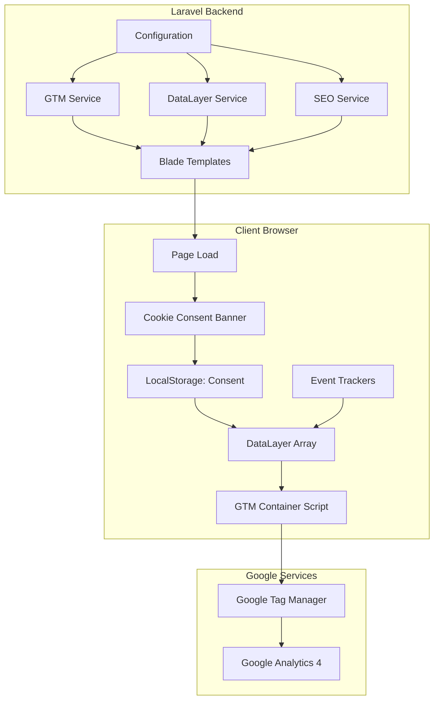
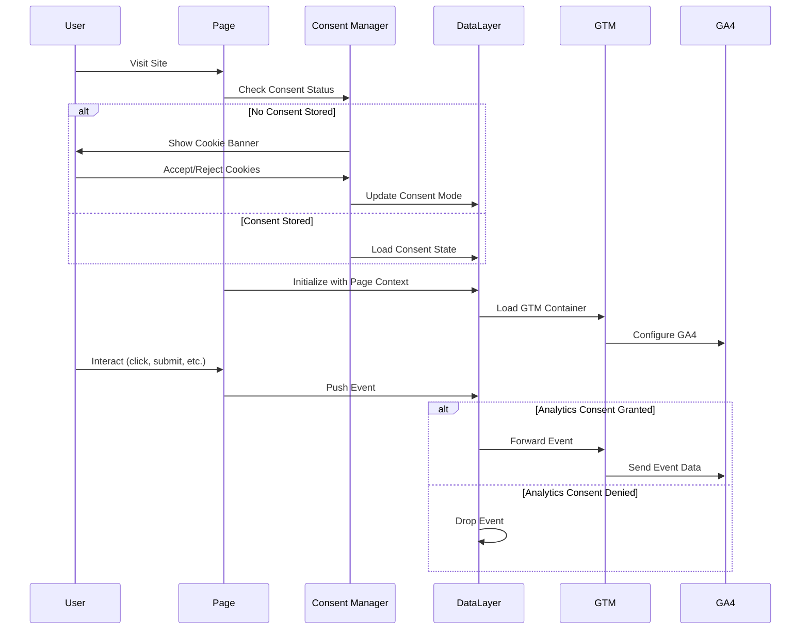
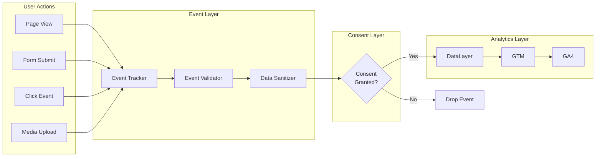

# Design Document: Google Analytics & SEO Implementation

## Overview

This design document specifies the technical implementation for integrating Google Analytics 4 (GA4), Google Tag Manager (GTM), GDPR-compliant cookie consent management, comprehensive event tracking, and enhanced SEO optimization into a Laravel 11 memorial application.

### System Goals

- Implement GTM and GA4 for comprehensive analytics tracking
- Provide GDPR-compliant cookie consent management across 6 locales (bs, sr, hr, de, en, it)
- Track 12 distinct event types for user behavior analysis
- Enhance SEO with structured data, optimized meta tags, and improved sitemaps
- Maintain performance standards (< 100ms analytics overhead, CLS < 0.01)
- Ensure Content Security Policy (CSP) compatibility
- Support debugging and testing workflows

### Key Design Principles

1. **Privacy-First**: All tracking respects user consent choices
2. **Performance-Optimized**: Async loading, minimal blocking, lazy initialization
3. **Locale-Aware**: Full multi-language support for all user-facing components
4. **Testable**: Debug modes, validation tools, and comprehensive testing support
5. **Maintainable**: Clear separation of concerns, configuration-driven behavior
6. **Secure**: CSP-compliant, XSS-protected, sanitized data handling

## Architecture

### High-Level System Architecture



### Component Interaction Flow



### Data Flow Architecture



## Components and Interfaces

### A. GTM Integration Component

#### GTM Loader Service (PHP)

**Purpose**: Server-side service to generate GTM script tags with environment-aware configuration.

**Location**: `app/Services/Analytics/GTMService.php`

**Interface**:
```php
class GTMService
{
    public function __construct(
        private ConfigRepository $config
    ) {}
    
    /**
     * Get GTM container ID for current environment
     */
    public function getContainerId(): ?string;
    
    /**
     * Check if GTM should be loaded
     */
    public function isEnabled(): bool;
    
    /**
     * Check if debug mode is enabled
     */
    public function isDebugMode(): bool;
    
    /**
     * Get GTM head script HTML
     */
    public function getHeadScript(): string;
    
    /**
     * Get GTM body noscript HTML
     */
    public function getBodyNoScript(): string;
    
    /**
     * Get CSP directives for GTM
     */
    public function getCspDirectives(): array;
}
```

**Key Behaviors**:
- Returns null container ID in development environment
- Uses production vs staging container IDs based on APP_ENV
- Generates nonce-compatible script tags when CSP nonce is available
- Provides CSP directives: `script-src`, `connect-src`, `img-src`

#### GTM Blade Components

**GTM Head Component**: `resources/views/components/analytics/gtm-head.blade.php`
```blade
@if($gtmService->isEnabled())
<!-- Google Tag Manager -->
<script{!! $nonce ? " nonce=\"{$nonce}\"" : '' !!}>
(function(w,d,s,l,i){w[l]=w[l]||[];w[l].push({'gtm.start':
new Date().getTime(),event:'gtm.js'});var f=d.getElementsByTagName(s)[0],
j=d.createElement(s),dl=l!='dataLayer'?'&l='+l:'';j.async=true;j.src=
'https://www.googletagmanager.com/gtm.js?id='+i+dl;f.parentNode.insertBefore(j,f);
})(window,document,'script','dataLayer','{{ $gtmService->getContainerId() }}');
</script>
<!-- End Google Tag Manager -->
@endif
```

**GTM Body Component**: `resources/views/components/analytics/gtm-body.blade.php`
```blade
@if($gtmService->isEnabled())
<!-- Google Tag Manager (noscript) -->
<noscript>
<iframe src="https://www.googletagmanager.com/ns.html?id={{ $gtmService->getContainerId() }}"
height="0" width="0" style="display:none;visibility:hidden" title="Google Tag Manager"></iframe>
</noscript>
<!-- End Google Tag Manager (noscript) -->
@endif
```

### B. Data Layer Manager

#### Data Layer Service (PHP)

**Purpose**: Generate initial data layer state with page and user context.

**Location**: `app/Services/Analytics/DataLayerService.php`

**Interface**:
```php
class DataLayerService
{
    /**
     * Get initial data layer state for current page
     */
    public function getInitialState(): array;
    
    /**
     * Get page type from current route
     */
    public function getPageType(): string;
    
    /**
     * Get user type (guest, registered)
     */
    public function getUserType(): string;
    
    /**
     * Get region from locale
     */
    public function getRegion(string $locale): string;
}
```

**Data Layer Schema**:
```javascript
{
  page_type: string,        // 'home', 'memorial', 'search', 'contact', etc.
  locale: string,           // 'bs', 'sr', 'hr', 'de', 'en', 'it'
  region: string,           // 'BA', 'RS', 'HR', 'DE', 'US', 'IT'
  user_type: string,        // 'guest', 'registered'
  page_path: string,        // Current URL path
  page_title: string        // Current page title
}
```

#### Data Layer Initialization (JavaScript)

**Location**: `resources/js/analytics/data-layer.js`

**Interface**:
```javascript
class DataLayerManager {
  constructor() {
    this.dataLayer = window.dataLayer || [];
    window.dataLayer = this.dataLayer;
  }
  
  /**
   * Push event to data layer
   */
  push(event: object): void;
  
  /**
   * Get current data layer state
   */
  getState(): array;
  
  /**
   * Update page context
   */
  updatePageContext(context: object): void;
}
```

### C. Cookie Consent Manager

#### Consent Manager Service (JavaScript)

**Location**: `resources/js/analytics/consent-manager.js`

**Interface**:
```javascript
class ConsentManager {
  constructor(options = {}) {
    this.storageKey = 'cookie_consent';
    this.version = 1;
    this.expirationMonths = 12;
  }
  
  /**
   * Check if consent banner should be shown
   */
  shouldShowBanner(): boolean;
  
  /**
   * Get current consent state
   */
  getConsent(): ConsentState | null;
  
  /**
   * Save consent preferences
   */
  saveConsent(preferences: ConsentPreferences): void;
  
  /**
   * Update GTM consent mode
   */
  updateGTMConsent(preferences: ConsentPreferences): void;
  
  /**
   * Check if consent has expired
   */
  isConsentExpired(consent: ConsentState): boolean;
  
  /**
   * Delete stored consent
   */
  deleteConsent(): void;
}
```

**Consent Storage Schema**:
```javascript
{
  version: number,          // Consent version (currently 1)
  timestamp: number,        // Unix timestamp when consent was given
  expiresAt: number,        // Unix timestamp when consent expires
  necessary: boolean,       // Always true (required cookies)
  analytics: boolean,       // User choice for analytics cookies
  marketing: boolean        // User choice for marketing cookies
}
```

**GTM Consent Mode Integration**:
```javascript
// Default consent state (before user choice)
gtag('consent', 'default', {
  'analytics_storage': 'denied',
  'ad_storage': 'denied',
  'functionality_storage': 'granted',
  'personalization_storage': 'denied',
  'security_storage': 'granted'
});

// Update consent after user choice
gtag('consent', 'update', {
  'analytics_storage': analyticsGranted ? 'granted' : 'denied',
  'ad_storage': marketingGranted ? 'granted' : 'denied'
});
```

#### Cookie Banner Component

**Location**: `resources/views/components/analytics/cookie-banner.blade.php`

**Structure**:
```blade
<div id="cookie-consent-banner" 
     class="cookie-banner" 
     role="dialog" 
     aria-labelledby="cookie-banner-title"
     aria-describedby="cookie-banner-description"
     style="display: none;">
  <div class="cookie-banner__content">
    <h2 id="cookie-banner-title">{{ __('cookies.banner.title') }}</h2>
    <p id="cookie-banner-description">{{ __('cookies.banner.description') }}</p>
    
    <div class="cookie-banner__actions">
      <button type="button" 
              id="cookie-accept-all" 
              class="btn btn-primary">
        {{ __('cookies.banner.accept_all') }}
      </button>
      
      <button type="button" 
              id="cookie-reject-all" 
              class="btn btn-secondary">
        {{ __('cookies.banner.reject_all') }}
      </button>
      
      <button type="button" 
              id="cookie-customize" 
              class="btn btn-link">
        {{ __('cookies.banner.customize') }}
      </button>
    </div>
    
    <a href="{{ route('privacy.policy', ['locale' => app()->getLocale()]) }}" 
       class="cookie-banner__privacy-link">
      {{ __('cookies.banner.privacy_policy') }}
    </a>
  </div>
  
  <div id="cookie-details" class="cookie-details" style="display: none;">
    <!-- Detailed cookie category toggles -->
  </div>
</div>
```

**Translation Keys** (example for `resources/lang/en/cookies.php`):
```php
return [
    'banner' => [
        'title' => 'Cookie Preferences',
        'description' => 'We use cookies to enhance your experience...',
        'accept_all' => 'Accept All',
        'reject_all' => 'Reject All',
        'customize' => 'Customize Settings',
        'privacy_policy' => 'Privacy Policy',
    ],
    'categories' => [
        'necessary' => [
            'title' => 'Necessary Cookies',
            'description' => 'Required for the website to function...',
        ],
        'analytics' => [
            'title' => 'Analytics Cookies',
            'description' => 'Help us understand how visitors use our site...',
        ],
        'marketing' => [
            'title' => 'Marketing Cookies',
            'description' => 'Used to deliver personalized advertisements...',
        ],
    ],
];
```

### D. Event Tracking System

#### Event Tracker Service (JavaScript)

**Location**: `resources/js/analytics/event-tracker.js`

**Interface**:
```javascript
class EventTracker {
  constructor(consentManager, dataLayerManager) {
    this.consentManager = consentManager;
    this.dataLayer = dataLayerManager;
    this.debugMode = window.analyticsDebugMode || false;
  }
  
  /**
   * Track page view event
   */
  trackPageView(params: PageViewParams): void;
  
  /**
   * Track memorial profile view
   */
  trackMemorialView(params: MemorialViewParams): void;
  
  /**
   * Track search query
   */
  trackSearch(params: SearchParams): void;
  
  /**
   * Track form submission
   */
  trackFormSubmit(params: FormSubmitParams): void;
  
  /**
   * Track user registration
   */
  trackSignUp(params: SignUpParams): void;
  
  /**
   * Track memorial creation
   */
  trackMemorialCreation(params: MemorialCreationParams): void;
  
  /**
   * Track media upload
   */
  trackMediaUpload(params: MediaUploadParams): void;
  
  /**
   * Track tribute submission
   */
  trackTributeSubmit(params: TributeParams): void;
  
  /**
   * Track navigation click
   */
  trackNavigationClick(params: NavigationParams): void;
  
  /**
   * Track external link click
   */
  trackOutboundClick(params: OutboundClickParams): void;
  
  /**
   * Track file download
   */
  trackFileDownload(params: FileDownloadParams): void;
  
  /**
   * Track JavaScript error
   */
  trackError(params: ErrorParams): void;
  
  /**
   * Check if tracking is allowed based on consent
   */
  private canTrack(): boolean;
  
  /**
   * Sanitize event parameters
   */
  private sanitizeParams(params: object): object;
  
  /**
   * Log event in debug mode
   */
  private debugLog(eventName: string, params: object): void;
}
```

**Event Parameter Schemas**:

```typescript
// Page View Event
interface PageViewParams {
  page_path: string;
  page_title: string;
  page_locale: string;
  page_type: string;
}

// Memorial View Event
interface MemorialViewParams {
  memorial_id: string;
  memorial_slug: string;
  locale: string;
  is_public: boolean;
}

// Search Event
interface SearchParams {
  search_term: string;
  results_count: number;
  locale: string;
}

// Form Submit Event
interface FormSubmitParams {
  form_type: string;      // 'contact', 'memorial_create', etc.
  locale: string;
  success: boolean;
  error_type?: string;    // Only when success is false
}

// Sign Up Event
interface SignUpParams {
  locale: string;
  registration_method: string;  // 'email', 'social', etc.
}

// Memorial Creation Event
interface MemorialCreationParams {
  locale: string;
  is_public: boolean;
}

// Media Upload Event
interface MediaUploadParams {
  media_type: 'image' | 'video';
  memorial_id: string;
  file_size_kb: number;
}

// Tribute Submit Event
interface TributeParams {
  memorial_id: string;
  locale: string;
  tribute_type: 'text' | 'image' | 'video';
}

// Navigation Click Event
interface NavigationParams {
  menu_item: string;
  destination_url: string;
  locale: string;
}

// Outbound Click Event
interface OutboundClickParams {
  link_url: string;
  link_text: string;
  page_location: string;
}

// File Download Event
interface FileDownloadParams {
  file_type: string;
  file_name: string;
  file_extension: string;
}

// Error Event
interface ErrorParams {
  error_type: string;
  error_message: string;
  page_url: string;
  user_agent: string;
}
```

### E. SEO System

#### Structured Data Service (PHP)

**Location**: `app/Services/SEO/StructuredDataService.php`

**Interface**:
```php
class StructuredDataService
{
    /**
     * Generate Organization schema
     */
    public function generateOrganizationSchema(): array;
    
    /**
     * Generate WebSite schema with SearchAction
     */
    public function generateWebSiteSchema(): array;
    
    /**
     * Generate Person schema for memorial profile
     */
    public function generatePersonSchema(Memorial $memorial): array;
    
    /**
     * Generate BreadcrumbList schema
     */
    public function generateBreadcrumbSchema(array $breadcrumbs): array;
    
    /**
     * Convert schema array to JSON-LD string
     */
    public function toJsonLd(array $schema): string;
    
    /**
     * Validate schema against Schema.org
     */
    public function validateSchema(array $schema): bool;
}
```

**Schema Structures**:

```php
// Organization Schema
[
    '@context' => 'https://schema.org',
    '@type' => 'Organization',
    'name' => 'Spomenar',
    'url' => 'https://example.com',
    'logo' => 'https://example.com/logo.png',
    'sameAs' => [
        'https://facebook.com/spomenar',
        'https://twitter.com/spomenar',
    ],
    'contactPoint' => [
        '@type' => 'ContactPoint',
        'contactType' => 'customer service',
        'email' => 'info@example.com',
    ],
]

// WebSite Schema with SearchAction
[
    '@context' => 'https://schema.org',
    '@type' => 'WebSite',
    'name' => 'Spomenar',
    'url' => 'https://example.com',
    'potentialAction' => [
        '@type' => 'SearchAction',
        'target' => [
            '@type' => 'EntryPoint',
            'urlTemplate' => 'https://example.com/search?q={search_term_string}',
        ],
        'query-input' => 'required name=search_term_string',
    ],
]

// Person Schema (Memorial Profile)
[
    '@context' => 'https://schema.org',
    '@type' => 'Person',
    'name' => 'John Doe',
    'birthDate' => '1950-01-15',
    'deathDate' => '2023-06-20',
    'image' => 'https://example.com/memorials/john-doe/photo.jpg',
    'description' => 'Loving father and dedicated teacher...',
]

// BreadcrumbList Schema
[
    '@context' => 'https://schema.org',
    '@type' => 'BreadcrumbList',
    'itemListElement' => [
        [
            '@type' => 'ListItem',
            'position' => 1,
            'name' => 'Home',
            'item' => 'https://example.com',
        ],
        [
            '@type' => 'ListItem',
            'position' => 2,
            'name' => 'Memorials',
            'item' => 'https://example.com/memorials',
        ],
    ],
]
```

#### Meta Tag Service (PHP)

**Location**: `app/Services/SEO/MetaTagService.php`

**Interface**:
```php
class MetaTagService
{
    /**
     * Generate meta description for page
     */
    public function generateDescription(string $pageType, array $context = []): string;
    
    /**
     * Generate Open Graph image URL
     */
    public function getOgImage(?string $imageUrl = null): string;
    
    /**
     * Generate Twitter Card meta tags
     */
    public function getTwitterCardTags(string $title, string $description, string $image): array;
    
    /**
     * Get canonical URL for current page
     */
    public function getCanonicalUrl(): string;
    
    /**
     * Sanitize meta content (remove HTML, limit length)
     */
    public function sanitize(string $content, int $maxLength = 160): string;
}
```

#### Sitemap Service (PHP)

**Location**: `app/Services/SEO/SitemapService.php`

**Interface**:
```php
class SitemapService
{
    /**
     * Generate sitemap for specific locale
     */
    public function generateSitemap(string $locale): string;
    
    /**
     * Generate sitemap index
     */
    public function generateSitemapIndex(): string;
    
    /**
     * Get priority for page type
     */
    public function getPriority(string $pageType): float;
    
    /**
     * Get change frequency for page type
     */
    public function getChangeFreq(string $pageType): string;
}
```

**Sitemap Configuration**:
```php
// Priority values
[
    'home' => 1.0,
    'memorial' => 0.8,
    'static' => 0.6,
    'search' => 0.5,
]

// Change frequency values
[
    'memorial' => 'weekly',
    'static' => 'monthly',
    'home' => 'daily',
]
```

## Data Models and Schemas

### Configuration Schema

**Environment Variables** (`.env`):
```env
# GTM Configuration
GTM_ID=GTM-XXXXXXX
GTM_ID_STAGING=GTM-YYYYYYY

# GA4 Configuration
GA4_MEASUREMENT_ID=G-XXXXXXXXXX

# Analytics Settings
ANALYTICS_ENABLED=true
ANALYTICS_DEBUG_MODE=false

# SEO Configuration
GOOGLE_SEARCH_CONSOLE_VERIFICATION=xxxxxxxxxxxxx
SITE_NAME="Spomenar"
SITE_URL=https://example.com

# Social Media
FACEBOOK_URL=https://facebook.com/spomenar
TWITTER_URL=https://twitter.com/spomenar
TWITTER_HANDLE=@spomenar
```

**Analytics Config** (`config/analytics.php`):
```php
return [
    'gtm' => [
        'enabled' => env('ANALYTICS_ENABLED', false),
        'container_id' => env('APP_ENV') === 'production' 
            ? env('GTM_ID') 
            : env('GTM_ID_STAGING'),
        'debug_mode' => env('ANALYTICS_DEBUG_MODE', false),
    ],
    
    'ga4' => [
        'measurement_id' => env('GA4_MEASUREMENT_ID'),
        'debug_mode' => env('ANALYTICS_DEBUG_MODE', false),
    ],
    
    'consent' => [
        'version' => 1,
        'expiration_months' => 12,
        'storage_key' => 'cookie_consent',
    ],
    
    'csp' => [
        'script_src' => [
            'https://www.googletagmanager.com',
            'https://www.google-analytics.com',
        ],
        'connect_src' => [
            'https://www.google-analytics.com',
            'https://analytics.google.com',
            'https://stats.g.doubleclick.net',
        ],
        'img_src' => [
            'https://www.google-analytics.com',
            'https://www.googletagmanager.com',
        ],
    ],
];
```

**SEO Config** (`config/seo.php`):
```php
return [
    'site' => [
        'name' => env('SITE_NAME', 'Spomenar'),
        'url' => env('SITE_URL', 'https://example.com'),
    ],
    
    'search_console' => [
        'verification' => env('GOOGLE_SEARCH_CONSOLE_VERIFICATION'),
    ],
    
    'social' => [
        'facebook' => env('FACEBOOK_URL'),
        'twitter' => env('TWITTER_URL'),
        'twitter_handle' => env('TWITTER_HANDLE'),
    ],
    
    'structured_data' => [
        'organization' => [
            'name' => env('SITE_NAME', 'Spomenar'),
            'logo' => '/logo.png',
            'contact_email' => 'info@example.com',
        ],
    ],
    
    'meta' => [
        'description_length' => [
            'min' => 120,
            'max' => 160,
        ],
        'default_og_image' => '/images/og-default.jpg',
    ],
    
    'sitemap' => [
        'priorities' => [
            'home' => 1.0,
            'memorial' => 0.8,
            'static' => 0.6,
            'search' => 0.5,
        ],
        'change_frequencies' => [
            'home' => 'daily',
            'memorial' => 'weekly',
            'static' => 'monthly',
        ],
    ],
];
```

## File Structure and Organization

```
resources/
  js/
    analytics/
      consent-manager.js       # Cookie consent management
      data-layer.js            # Data layer initialization and management
      event-tracker.js         # Event tracking service
      gtm-loader.js            # Client-side GTM utilities
      index.js                 # Main analytics entry point
    seo/
      structured-data.js       # Client-side structured data utilities (if needed)
  views/
    components/
      analytics/
        gtm-head.blade.php     # GTM head script component
        gtm-body.blade.php     # GTM body noscript component
        cookie-banner.blade.php # Cookie consent banner
        data-layer-init.blade.php # Data layer initialization
      seo/
        structured-data.blade.php # Structured data JSON-LD output
        meta-tags.blade.php       # Dynamic meta tags
    pages/
      cookie-settings.blade.php  # Cookie preferences management page
  lang/
    bs/
      cookies.php              # Bosnian cookie translations
    sr/
      cookies.php              # Serbian cookie translations
    hr/
      cookies.php              # Croatian cookie translations
    de/
      cookies.php              # German cookie translations
    en/
      cookies.php              # English cookie translations
    it/
      cookies.php              # Italian cookie translations

app/
  Services/
    Analytics/
      GTMService.php           # GTM integration service
      DataLayerService.php     # Data layer generation service
      EventTrackingService.php # Server-side event tracking utilities
    SEO/
      StructuredDataService.php # Structured data generation
      MetaTagService.php        # Meta tag generation
      SitemapService.php        # Sitemap generation
  View/
    Components/
      Analytics/
        GTMHead.php            # GTM head component class
        GTMBody.php            # GTM body component class
        CookieBanner.php       # Cookie banner component class
        DataLayerInit.php      # Data layer init component class
      SEO/
        StructuredData.php     # Structured data component class
        MetaTags.php           # Meta tags component class
  Http/
    Controllers/
      CookieSettingsController.php # Cookie settings page controller
      SitemapController.php         # Sitemap generation controller

config/
  analytics.php              # Analytics configuration
  seo.php                    # SEO configuration

routes/
  web.php                    # Add cookie settings and sitemap routes

tests/
  Feature/
    Analytics/
      GTMIntegrationTest.php
      ConsentManagementTest.php
      EventTrackingTest.php
    SEO/
      StructuredDataTest.php
      MetaTagsTest.php
      SitemapTest.php
  Unit/
    Services/
      Analytics/
        GTMServiceTest.php
        DataLayerServiceTest.php
      SEO/
        StructuredDataServiceTest.php
        MetaTagServiceTest.php
```


## Integration Points

### A. Blade Template Integration

#### Main Layout Integration (`resources/views/layouts/app.blade.php`)

**In `<head>` section** (before closing `</head>`):
```blade
{{-- Data Layer Initialization --}}
<x-analytics.data-layer-init />

{{-- GTM Head Script --}}
<x-analytics.gtm-head />

{{-- Structured Data --}}
<x-seo.structured-data />

{{-- Google Search Console Verification --}}
@if(config('seo.search_console.verification'))
<meta name="google-site-verification" content="{{ config('seo.search_console.verification') }}">
@endif

{{-- Resource Hints --}}
<link rel="preconnect" href="https://www.googletagmanager.com">
<link rel="dns-prefetch" href="https://www.google-analytics.com">
<link rel="dns-prefetch" href="https://stats.g.doubleclick.net">
```

**After opening `<body>` tag**:
```blade
<body class="min-h-screen flex flex-col">
    {{-- GTM Body NoScript --}}
    <x-analytics.gtm-body />
    
    {{-- Cookie Consent Banner --}}
    <x-analytics.cookie-banner />
    
    {{-- Rest of body content --}}
```

#### Memorial Profile Page Integration

**In memorial profile view** (`resources/views/memorials/show.blade.php`):
```blade
@section('head')
    {{-- Person Structured Data --}}
    <x-seo.structured-data type="person" :memorial="$memorial" />
    
    {{-- Open Graph Image --}}
    <meta property="og:image" content="{{ $memorial->primaryPhoto?->url ?? asset('images/og-memorial-default.jpg') }}">
@endsection

@section('scripts')
<script>
    // Track memorial view
    if (window.eventTracker) {
        window.eventTracker.trackMemorialView({
            memorial_id: '{{ $memorial->id }}',
            memorial_slug: '{{ $memorial->slug }}',
            locale: '{{ app()->getLocale() }}',
            is_public: {{ $memorial->is_public ? 'true' : 'false' }}
        });
    }
</script>
@endsection
```

### B. JavaScript Integration

#### Main JavaScript Entry Point (`resources/js/app.js`)

```javascript
import Alpine from 'alpinejs';
import { ConsentManager } from './analytics/consent-manager';
import { DataLayerManager } from './analytics/data-layer';
import { EventTracker } from './analytics/event-tracker';

// Initialize Alpine
window.Alpine = Alpine;
Alpine.start();

// Initialize Analytics
document.addEventListener('DOMContentLoaded', () => {
    // Initialize consent manager
    const consentManager = new ConsentManager();
    window.consentManager = consentManager;
    
    // Initialize data layer manager
    const dataLayerManager = new DataLayerManager();
    window.dataLayerManager = dataLayerManager;
    
    // Initialize event tracker
    const eventTracker = new EventTracker(consentManager, dataLayerManager);
    window.eventTracker = eventTracker;
    
    // Show cookie banner if needed
    if (consentManager.shouldShowBanner()) {
        document.getElementById('cookie-consent-banner').style.display = 'block';
    }
    
    // Track initial page view
    eventTracker.trackPageView({
        page_path: window.location.pathname,
        page_title: document.title,
        page_locale: document.documentElement.lang,
        page_type: window.dataLayer?.[0]?.page_type || 'unknown'
    });
    
    // Attach event listeners
    attachEventListeners(eventTracker);
});

function attachEventListeners(eventTracker) {
    // Track navigation clicks
    document.querySelectorAll('nav a').forEach(link => {
        link.addEventListener('click', (e) => {
            eventTracker.trackNavigationClick({
                menu_item: e.target.textContent.trim(),
                destination_url: e.target.href,
                locale: document.documentElement.lang
            });
        });
    });
    
    // Track external links
    document.querySelectorAll('a[href^="http"]').forEach(link => {
        if (!link.href.includes(window.location.hostname)) {
            link.addEventListener('click', (e) => {
                eventTracker.trackOutboundClick({
                    link_url: e.target.href,
                    link_text: e.target.textContent.trim(),
                    page_location: window.location.href
                });
            });
        }
    });
    
    // Track file downloads
    document.querySelectorAll('a[download]').forEach(link => {
        link.addEventListener('click', (e) => {
            const url = new URL(e.target.href);
            const filename = url.pathname.split('/').pop();
            const extension = filename.split('.').pop();
            
            eventTracker.trackFileDownload({
                file_type: extension,
                file_name: filename,
                file_extension: extension
            });
        });
    });
    
    // Track JavaScript errors
    window.addEventListener('error', (e) => {
        eventTracker.trackError({
            error_type: 'javascript_error',
            error_message: e.message,
            page_url: window.location.href,
            user_agent: navigator.userAgent
        });
    });
}
```

#### Form Submission Tracking

**Example for contact form**:
```javascript
document.querySelector('#contact-form').addEventListener('submit', async (e) => {
    e.preventDefault();
    
    const formData = new FormData(e.target);
    
    try {
        const response = await fetch(e.target.action, {
            method: 'POST',
            body: formData,
            headers: {
                'X-CSRF-TOKEN': document.querySelector('meta[name="csrf-token"]').content
            }
        });
        
        if (response.ok) {
            window.eventTracker.trackFormSubmit({
                form_type: 'contact',
                locale: document.documentElement.lang,
                success: true
            });
        } else {
            window.eventTracker.trackFormSubmit({
                form_type: 'contact',
                locale: document.documentElement.lang,
                success: false,
                error_type: 'server_error'
            });
        }
    } catch (error) {
        window.eventTracker.trackFormSubmit({
            form_type: 'contact',
            locale: document.documentElement.lang,
            success: false,
            error_type: 'network_error'
        });
    }
});
```

### C. Backend Integration

#### Controller Integration Example

**Memorial Creation Controller**:
```php
public function store(CreateMemorialRequest $request)
{
    $memorial = Memorial::create($request->validated());
    
    // Return success with tracking data
    return response()->json([
        'success' => true,
        'memorial' => $memorial,
        'tracking' => [
            'event' => 'create_memorial',
            'params' => [
                'locale' => app()->getLocale(),
                'is_public' => $memorial->is_public,
            ],
        ],
    ]);
}
```

**Frontend handling**:
```javascript
const response = await fetch('/api/memorials', {
    method: 'POST',
    body: formData
});

const data = await response.json();

if (data.success && data.tracking) {
    window.eventTracker.trackMemorialCreation(data.tracking.params);
}
```

#### Middleware for Analytics Context

**Location**: `app/Http/Middleware/InjectAnalyticsContext.php`

```php
class InjectAnalyticsContext
{
    public function handle(Request $request, Closure $next)
    {
        // Share analytics context with all views
        View::share('analyticsContext', [
            'page_type' => $this->getPageType($request),
            'locale' => app()->getLocale(),
            'user_type' => auth()->check() ? 'registered' : 'guest',
        ]);
        
        return $next($request);
    }
    
    private function getPageType(Request $request): string
    {
        $routeName = $request->route()?->getName();
        
        return match($routeName) {
            'home' => 'home',
            'memorial.show' => 'memorial',
            'memorial.index' => 'memorial_list',
            'search' => 'search',
            'contact' => 'contact',
            default => 'other',
        };
    }
}
```

## Security Considerations

### Content Security Policy (CSP)

**CSP Header Configuration** (in `bootstrap/app.php` or middleware):

```php
$cspDirectives = [
    "default-src 'self'",
    "script-src 'self' 'nonce-{$nonce}' https://www.googletagmanager.com",
    "connect-src 'self' https://www.google-analytics.com https://analytics.google.com https://stats.g.doubleclick.net",
    "img-src 'self' data: https://www.google-analytics.com https://www.googletagmanager.com",
    "style-src 'self' 'unsafe-inline' https://fonts.googleapis.com",
    "font-src 'self' https://fonts.gstatic.com",
    "frame-src https://www.googletagmanager.com",
];

header("Content-Security-Policy: " . implode('; ', $cspDirectives));
```

### XSS Prevention in Event Parameters

**Data Sanitization**:
```javascript
class EventTracker {
    private sanitizeParams(params) {
        const sanitized = {};
        
        for (const [key, value] of Object.entries(params)) {
            if (typeof value === 'string') {
                // Remove HTML tags
                sanitized[key] = value.replace(/<[^>]*>/g, '');
                // Limit length
                sanitized[key] = sanitized[key].substring(0, 500);
            } else if (typeof value === 'number' || typeof value === 'boolean') {
                sanitized[key] = value;
            } else {
                // Skip complex objects
                continue;
            }
        }
        
        return sanitized;
    }
}
```

### Secure Cookie Consent Storage

**LocalStorage Security**:
- Store only consent preferences (no PII)
- Validate data structure on read
- Handle corrupted data gracefully

```javascript
class ConsentManager {
    getConsent() {
        try {
            const stored = localStorage.getItem(this.storageKey);
            if (!stored) return null;
            
            const consent = JSON.parse(stored);
            
            // Validate structure
            if (!this.isValidConsent(consent)) {
                this.deleteConsent();
                return null;
            }
            
            return consent;
        } catch (error) {
            console.error('Failed to read consent:', error);
            this.deleteConsent();
            return null;
        }
    }
    
    isValidConsent(consent) {
        return (
            typeof consent === 'object' &&
            typeof consent.version === 'number' &&
            typeof consent.timestamp === 'number' &&
            typeof consent.necessary === 'boolean' &&
            typeof consent.analytics === 'boolean' &&
            typeof consent.marketing === 'boolean'
        );
    }
}
```

### GDPR Compliance Measures

1. **Consent Before Tracking**: No analytics data sent until user grants consent
2. **IP Anonymization**: Enabled in GA4 configuration
3. **Data Retention**: Set to 14 months in GA4
4. **User Rights**: Provide data deletion request mechanism
5. **Consent Expiration**: Re-prompt users after 12 months
6. **Clear Communication**: Transparent cookie descriptions in all languages

## Performance Optimization

### Async Script Loading Strategy

**GTM Script Loading**:
```javascript
// Async GTM loader
(function(w,d,s,l,i){
    w[l]=w[l]||[];
    w[l].push({'gtm.start': new Date().getTime(), event:'gtm.js'});
    var f=d.getElementsByTagName(s)[0],
        j=d.createElement(s),
        dl=l!='dataLayer'?'&l='+l:'';
    j.async=true;  // Async loading
    j.src='https://www.googletagmanager.com/gtm.js?id='+i+dl;
    f.parentNode.insertBefore(j,f);
})(window,document,'script','dataLayer','GTM-XXXXXXX');
```

### Critical vs Non-Critical Tracking

**Priority Levels**:
1. **Critical** (immediate): Page view, consent updates
2. **High** (after DOMContentLoaded): Form submissions, memorial views
3. **Low** (after page interactive): Navigation clicks, scroll tracking

```javascript
// Defer non-critical tracking
if (document.readyState === 'complete') {
    attachNonCriticalTracking();
} else {
    window.addEventListener('load', attachNonCriticalTracking);
}
```

### Lazy Loading Images

**Image Component**:
```blade
url }}" 
     alt="{{ $image->alt }}"
     width="{{ $image->width }}"
     height="{{ $image->height }}"
     loading="{{ $aboveFold ? 'eager' : 'lazy' }}"
     decoding="async">
```

### Resource Hints

**In layout head**:
```blade
{{-- Preconnect to critical domains --}}
<link rel="preconnect" href="https://fonts.googleapis.com">
<link rel="preconnect" href="https://fonts.gstatic.com" crossorigin>
<link rel="preconnect" href="https://www.googletagmanager.com">

{{-- DNS prefetch for analytics --}}
<link rel="dns-prefetch" href="https://www.google-analytics.com">
<link rel="dns-prefetch" href="https://stats.g.doubleclick.net">
```

### Bundle Size Optimization

**Vite Configuration** (`vite.config.js`):
```javascript
export default defineConfig({
    build: {
        rollupOptions: {
            output: {
                manualChunks: {
                    'analytics': [
                        './resources/js/analytics/consent-manager.js',
                        './resources/js/analytics/data-layer.js',
                        './resources/js/analytics/event-tracker.js',
                    ],
                },
            },
        },
    },
});
```

### Performance Budget

**Targets**:
- Analytics overhead: < 100ms to page load time
- GTM container size: < 50KB
- JavaScript bundle (analytics): < 30KB gzipped
- CLS impact: < 0.01
- No render-blocking scripts

## Multi-Language Support

### Translation File Structure

**Cookie Consent Translations** (`resources/lang/{locale}/cookies.php`):

```php
// resources/lang/bs/cookies.php (Bosnian)
return [
    'banner' => [
        'title' => 'Postavke kolačića',
        'description' => 'Koristimo kolačiće kako bismo poboljšali vaše iskustvo...',
        'accept_all' => 'Prihvati sve',
        'reject_all' => 'Odbij sve',
        'customize' => 'Prilagodi postavke',
        'privacy_policy' => 'Politika privatnosti',
        'save_preferences' => 'Sačuvaj postavke',
    ],
    'categories' => [
        'necessary' => [
            'title' => 'Neophodni kolačići',
            'description' => 'Potrebni za funkcionisanje web stranice. Ne mogu se onemogućiti.',
        ],
        'analytics' => [
            'title' => 'Analitički kolačići',
            'description' => 'Pomažu nam da razumijemo kako posjetitelji koriste našu stranicu.',
        ],
        'marketing' => [
            'title' => 'Marketing kolačići',
            'description' => 'Koriste se za prikazivanje personalizovanih oglasa.',
        ],
    ],
    'settings_page' => [
        'title' => 'Upravljanje kolačićima',
        'description' => 'Ovdje možete upravljati svojim postavkama kolačića.',
        'last_updated' => 'Posljednje ažurirano',
        'consent_given' => 'Saglasnost data',
    ],
];
```

Similar files for: `sr/cookies.php`, `hr/cookies.php`, `de/cookies.php`, `en/cookies.php`, `it/cookies.php`

### Locale-Specific Structured Data

**Person Schema with Locale**:
```php
public function generatePersonSchema(Memorial $memorial): array
{
    $locale = app()->getLocale();
    
    return [
        '@context' => 'https://schema.org',
        '@type' => 'Person',
        'name' => $memorial->name,
        'birthDate' => $memorial->birth_date?->format('Y-m-d'),
        'deathDate' => $memorial->death_date?->format('Y-m-d'),
        'image' => $memorial->primaryPhoto?->url,
        'description' => $memorial->getTranslation('description', $locale),
        'inLanguage' => $locale,
    ];
}
```

### Locale-Specific Meta Tags

**Dynamic Meta Description**:
```php
public function generateDescription(string $pageType, array $context = []): string
{
    $locale = app()->getLocale();
    
    return match($pageType) {
        'memorial' => __('seo.memorial_description', [
            'name' => $context['name'],
            'dates' => $context['dates'],
        ], $locale),
        'search' => __('seo.search_description', [
            'term' => $context['term'],
        ], $locale),
        default => __('seo.default_description', [], $locale),
    };
}
```

## Error Handling and Fallbacks

### GTM Load Failure Handling

```javascript
class GTMLoader {
    constructor() {
        this.loaded = false;
        this.timeout = 5000; // 5 second timeout
    }
    
    async load(containerId) {
        return new Promise((resolve, reject) => {
            const timer = setTimeout(() => {
                if (!this.loaded) {
                    console.warn('GTM failed to load within timeout');
                    reject(new Error('GTM load timeout'));
                }
            }, this.timeout);
            
            // Load GTM script
            const script = document.createElement('script');
            script.src = `https://www.googletagmanager.com/gtm.js?id=${containerId}`;
            script.async = true;
            
            script.onload = () => {
                this.loaded = true;
                clearTimeout(timer);
                resolve();
            };
            
            script.onerror = () => {
                clearTimeout(timer);
                console.error('Failed to load GTM script');
                reject(new Error('GTM script load failed'));
            };
            
            document.head.appendChild(script);
        });
    }
}
```

### Network Error Handling

```javascript
class EventTracker {
    trackEvent(eventName, params) {
        try {
            if (!this.canTrack()) {
                this.debugLog('Tracking blocked by consent', eventName);
                return;
            }
            
            const sanitized = this.sanitizeParams(params);
            
            this.dataLayer.push({
                event: eventName,
                ...sanitized
            });
            
            this.debugLog('Event tracked', eventName, sanitized);
        } catch (error) {
            console.error('Failed to track event:', eventName, error);
            // Don't throw - fail silently for analytics
        }
    }
}
```

### Consent Storage Failure Handling

```javascript
class ConsentManager {
    saveConsent(preferences) {
        try {
            const consent = {
                version: this.version,
                timestamp: Date.now(),
                expiresAt: Date.now() + (this.expirationMonths * 30 * 24 * 60 * 60 * 1000),
                ...preferences
            };
            
            localStorage.setItem(this.storageKey, JSON.stringify(consent));
            this.updateGTMConsent(preferences);
        } catch (error) {
            console.error('Failed to save consent:', error);
            
            // Fallback: use session storage
            try {
                sessionStorage.setItem(this.storageKey, JSON.stringify(consent));
            } catch (sessionError) {
                console.error('Failed to save to session storage:', sessionError);
                // Last resort: in-memory storage (lost on page reload)
                this.inMemoryConsent = consent;
            }
        }
    }
}
```

### Graceful Degradation

**No JavaScript Scenario**:
- GTM noscript iframe still loads for basic tracking
- Cookie banner shows with form-based submission
- Structured data still present in HTML
- Meta tags still functional

**Ad Blocker Scenario**:
- Detect GTM blocking
- Don't show errors to user
- Log to console in debug mode
- Continue site functionality normally

```javascript
// Detect if GTM is blocked
setTimeout(() => {
    if (typeof window.google_tag_manager === 'undefined') {
        console.info('GTM appears to be blocked by ad blocker');
        // Continue without analytics
    }
}, 3000);
```

## Monitoring and Debugging

### Debug Mode Implementation

**Enable Debug Mode**:
```javascript
// Set via URL parameter: ?analytics_debug=1
const urlParams = new URLSearchParams(window.location.search);
window.analyticsDebugMode = urlParams.get('analytics_debug') === '1' || 
                            {{ config('analytics.gtm.debug_mode') ? 'true' : 'false' }};
```

**Debug Logging**:
```javascript
class EventTracker {
    debugLog(message, ...args) {
        if (this.debugMode) {
            console.group(`[Analytics Debug] ${message}`);
            args.forEach(arg => console.log(arg));
            console.groupEnd();
        }
    }
    
    trackEvent(eventName, params) {
        this.debugLog('Tracking Event', {
            event: eventName,
            params: params,
            consent: this.consentManager.getConsent(),
            timestamp: new Date().toISOString()
        });
        
        // ... rest of tracking logic
    }
}
```

### Console Logging Strategy

**Log Levels**:
1. **Error**: Failed operations (always logged)
2. **Warn**: Degraded functionality (always logged)
3. **Info**: Important state changes (debug mode only)
4. **Debug**: Detailed tracking info (debug mode only)

```javascript
const logger = {
    error: (message, ...args) => console.error(`[Analytics Error] ${message}`, ...args),
    warn: (message, ...args) => console.warn(`[Analytics Warning] ${message}`, ...args),
    info: (message, ...args) => {
        if (window.analyticsDebugMode) {
            console.info(`[Analytics] ${message}`, ...args);
        }
    },
    debug: (message, ...args) => {
        if (window.analyticsDebugMode) {
            console.log(`[Analytics Debug] ${message}`, ...args);
        }
    }
};
```

### GTM Preview Mode Support

**Detect Preview Mode**:
```javascript
const isGTMPreview = () => {
    return window.location.search.includes('gtm_debug') ||
           window.location.search.includes('gtm_auth');
};

if (isGTMPreview()) {
    console.info('GTM Preview Mode Active');
    window.analyticsDebugMode = true;
}
```

### GA4 DebugView Integration

**Enable Debug Mode**:
```javascript
// Push debug_mode parameter
window.dataLayer = window.dataLayer || [];
window.dataLayer.push({
    'debug_mode': {{ config('analytics.ga4.debug_mode') ? 'true' : 'false' }}
});
```

**Debug Event Tracking**:
```javascript
if (window.analyticsDebugMode) {
    // Send events to DebugView
    window.dataLayer.push({
        event: eventName,
        debug_mode: true,
        ...params
    });
}
```

### Validation Tools

**Event Validation Test Page** (`resources/views/pages/analytics-test.blade.php`):
```blade
@if(app()->environment(['local', 'staging']))
<div class="analytics-test-panel">
    <h2>Analytics Event Testing</h2>
    
    <div class="test-section">
        <h3>Page View</h3>
        <button onclick="testPageView()">Test Page View Event</button>
    </div>
    
    <div class="test-section">
        <h3>Memorial View</h3>
        <button onclick="testMemorialView()">Test Memorial View Event</button>
    </div>
    
    <!-- More test buttons for each event type -->
    
    <div class="event-log">
        <h3>Event Log</h3>
        <pre id="event-log-output"></pre>
    </div>
</div>

<script>
function testPageView() {
    window.eventTracker.trackPageView({
        page_path: '/test',
        page_title: 'Test Page',
        page_locale: 'en',
        page_type: 'test'
    });
    logEvent('page_view', arguments[0]);
}

function logEvent(eventName, params) {
    const log = document.getElementById('event-log-output');
    log.textContent += `\n[${new Date().toISOString()}] ${eventName}: ${JSON.stringify(params, null, 2)}`;
}
</script>
@endif
```

