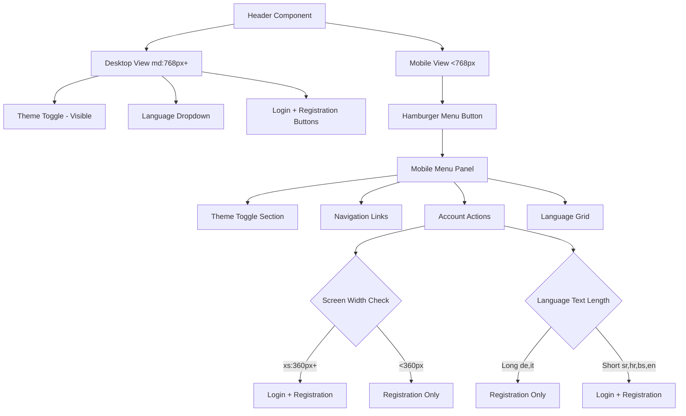
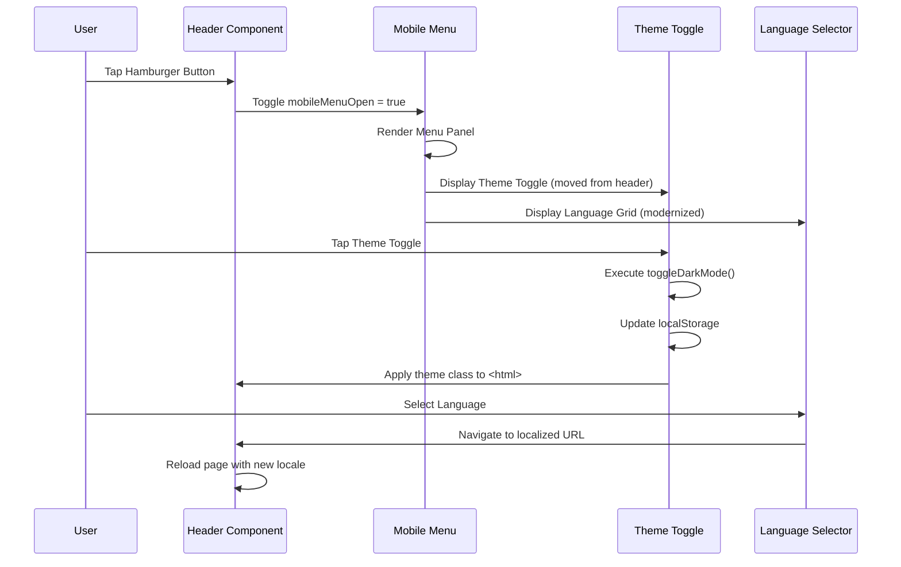
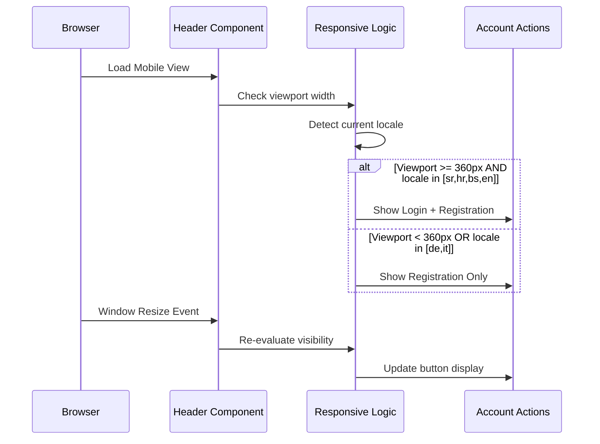

# Design Document: Mobile Header UX Improvements

## Overview

This feature enhances the mobile header user experience by reorganizing UI elements for better usability on small screens. The design addresses three key improvements: (1) moving the theme toggle into the hamburger menu to reduce header clutter, (2) implementing intelligent button visibility logic that hides the "Login" button on smaller screens or when language text is too long (German, Italian), keeping only "Registration", and (3) modernizing the hamburger menu design with improved visual hierarchy and a better language selector layout.

The solution maintains the existing Laravel Blade architecture while introducing responsive logic based on viewport width and language-specific text length detection. All changes are backward compatible and preserve existing functionality for desktop views.

## Architecture



## Sequence Diagrams

### Mobile Menu Interaction Flow



### Responsive Button Visibility Logic



## Components and Interfaces

### Component 1: Header Component (header.blade.php)

**Purpose**: Main header component that adapts layout based on viewport size and provides navigation, authentication, theme switching, and language selection.

**Interface**:
```php
// Component Props
@props([
    'transparent' => false,  // Whether header has transparent background
    'absolute' => false      // Whether header uses absolute positioning
])

// Computed Variables
$isTransparent: bool        // Determines styling for transparent mode
$isAbsolute: bool          // Determines positioning class
$currentLocale: string     // Current application locale (sr, hr, bs, de, en, it)
$availableLocales: array   // Map of locale codes to translated names
```

**Responsibilities**:
- Render desktop navigation with theme toggle, language dropdown, and auth buttons
- Render mobile hamburger menu with reorganized UI elements
- Handle responsive visibility logic for Login/Registration buttons
- Manage Alpine.js state for mobile menu and language dropdown
- Apply dynamic styling based on transparent/absolute props

### Component 2: Dark Mode Toggle (dark-mode-toggle.blade.php)

**Purpose**: Reusable button component for toggling between light and dark themes.

**Interface**:
```php
// No props - standalone component

// Global Function
toggleDarkMode(): void  // Switches theme and updates localStorage
```

**Responsibilities**:
- Display sun icon in dark mode, moon icon in light mode
- Call toggleDarkMode() JavaScript function on click
- Provide accessible aria-label and title attributes

### Component 3: Mobile Menu Panel

**Purpose**: Collapsible menu panel that appears on mobile devices, containing theme toggle, navigation, account actions, and language selector.

**Interface**:
```php
// Alpine.js State
mobileMenuOpen: boolean  // Controls menu visibility

// Sections
- Theme Toggle Section (new location)
- Navigation Links Section
- Account Actions Section (with responsive button logic)
- Language Grid Section (modernized layout)
```

**Responsibilities**:
- Display theme toggle as first section (moved from desktop-only area)
- Show navigation links with icons
- Render Login/Registration buttons with responsive visibility
- Display language selector in modern grid layout
- Handle menu open/close transitions

## Data Models

### Locale Configuration

```php
interface LocaleConfig {
    code: string;           // Locale code (sr, hr, bs, de, en, it)
    label: string;          // Translated language name
    isLongText: boolean;    // Whether this locale has long button text
}

// Example
$availableLocales = [
    'sr' => 'Srpski',       // isLongText: false
    'hr' => 'Hrvatski',     // isLongText: false
    'bs' => 'Bosanski',     // isLongText: false
    'de' => 'Deutsch',      // isLongText: true (long auth button text)
    'en' => 'English',      // isLongText: false
    'it' => 'Italiano',     // isLongText: true (long auth button text)
];
```

### Responsive Breakpoint Configuration

```php
interface ResponsiveBreakpoints {
    xs: string;   // 360px - Extra small phones
    sm: string;   // 640px - Small devices
    md: string;   // 768px - Medium devices (tablet)
    lg: string;   // 1024px - Large devices
    xl: string;   // 1280px - Extra large devices
}

// Tailwind Default Breakpoints
$breakpoints = [
    'xs' => '360px',  // Custom breakpoint for very small phones
    'sm' => '640px',
    'md' => '768px',  // Mobile/Desktop boundary
    'lg' => '1024px',
    'xl' => '1280px',
];
```

### Theme State Model

```php
interface ThemeState {
    current: 'light' | 'dark';           // Current active theme
    stored: 'light' | 'dark' | null;     // Theme stored in localStorage
    systemPreference: 'light' | 'dark';  // OS-level theme preference
}

// localStorage key: 'darkMode'
// HTML class: 'dark' or 'light'
```

## Algorithmic Pseudocode

### Main Responsive Button Visibility Algorithm

```pascal
ALGORITHM determineButtonVisibility(viewport, locale)
INPUT: viewport (width in pixels), locale (string)
OUTPUT: buttonConfig (object with login and registration visibility)

BEGIN
  // Define long-text locales
  longTextLocales ← ['de', 'it']
  
  // Initialize button configuration
  buttonConfig ← {
    showLogin: true,
    showRegistration: true
  }
  
  // Check viewport width constraint
  IF viewport < 360 THEN
    buttonConfig.showLogin ← false
    RETURN buttonConfig
  END IF
  
  // Check language text length constraint
  IF locale IN longTextLocales THEN
    buttonConfig.showLogin ← false
    RETURN buttonConfig
  END IF
  
  // Both buttons visible for normal cases
  RETURN buttonConfig
END
```

**Preconditions:**
- viewport is a positive integer representing pixel width
- locale is a valid locale code string (sr, hr, bs, de, en, it)

**Postconditions:**
- buttonConfig.showRegistration is always true
- buttonConfig.showLogin is false if viewport < 360px OR locale in ['de', 'it']
- buttonConfig.showLogin is true otherwise

**Loop Invariants:** N/A (no loops in this algorithm)

### Theme Toggle Algorithm

```pascal
ALGORITHM toggleDarkMode()
INPUT: None (reads from DOM and localStorage)
OUTPUT: None (modifies DOM and localStorage)

BEGIN
  // Read current theme state
  htmlElement ← document.documentElement
  isDark ← htmlElement.classList.contains('dark')
  
  // Determine next theme
  IF isDark = true THEN
    nextTheme ← 'light'
  ELSE
    nextTheme ← 'dark'
  END IF
  
  // Apply theme to DOM
  htmlElement.classList.remove('dark', 'light')
  htmlElement.classList.add(nextTheme)
  
  // Persist to localStorage
  localStorage.setItem('darkMode', nextTheme)
  
  // Dispatch custom event for theme change listeners
  event ← new CustomEvent('themeChanged', { detail: { theme: nextTheme } })
  window.dispatchEvent(event)
END
```

**Preconditions:**
- document.documentElement exists and is accessible
- localStorage is available and not blocked

**Postconditions:**
- HTML element has exactly one theme class ('dark' or 'light')
- localStorage contains the new theme value
- Theme change event is dispatched to window

**Loop Invariants:** N/A (no loops in this algorithm)

### Mobile Menu Rendering Algorithm

```pascal
ALGORITHM renderMobileMenu(isOpen, currentLocale, isAuthenticated)
INPUT: isOpen (boolean), currentLocale (string), isAuthenticated (boolean)
OUTPUT: renderedHTML (string)

BEGIN
  IF isOpen = false THEN
    RETURN empty string
  END IF
  
  // Initialize menu sections
  sections ← []
  
  // Section 1: Theme Toggle (NEW - moved from desktop)
  themeSection ← createThemeToggleSection()
  sections.append(themeSection)
  
  // Section 2: Navigation Links
  navSection ← createNavigationSection(isAuthenticated)
  sections.append(navSection)
  
  // Section 3: Account Actions (with responsive logic)
  viewport ← window.innerWidth
  buttonConfig ← determineButtonVisibility(viewport, currentLocale)
  
  IF isAuthenticated = true THEN
    accountSection ← createLogoutSection()
  ELSE
    accountSection ← createAuthButtonsSection(buttonConfig)
  END IF
  sections.append(accountSection)
  
  // Section 4: Language Grid (MODERNIZED)
  languageSection ← createModernLanguageGrid(currentLocale)
  sections.append(languageSection)
  
  // Combine all sections with proper spacing and borders
  renderedHTML ← joinSections(sections)
  
  RETURN renderedHTML
END
```

**Preconditions:**
- isOpen is a boolean value
- currentLocale is a valid locale code
- isAuthenticated is a boolean value
- window.innerWidth is accessible

**Postconditions:**
- Returns empty string if menu is closed
- Returns complete HTML structure if menu is open
- Theme toggle section appears first
- Language section appears last with modernized grid layout
- Account section respects responsive button visibility rules

**Loop Invariants:**
- All sections maintain consistent spacing and border styling
- Each section is properly separated with border-t divider

## Key Functions with Formal Specifications

### Function 1: createAuthButtonsSection()

```php
function createAuthButtonsSection(array $buttonConfig): string
```

**Preconditions:**
- `$buttonConfig` is an associative array with keys 'showLogin' and 'showRegistration'
- Both values are boolean
- 'showRegistration' is always true

**Postconditions:**
- Returns HTML string containing account actions section
- Registration button is always visible
- Login button visibility matches `$buttonConfig['showLogin']`
- Proper Tailwind classes applied for responsive behavior
- Section includes "Account" label header

**Loop Invariants:** N/A

### Function 2: createModernLanguageGrid()

```php
function createModernLanguageGrid(string $currentLocale): string
```

**Preconditions:**
- `$currentLocale` is a valid locale code (sr, hr, bs, de, en, it)
- `$availableLocales` array is defined and populated

**Postconditions:**
- Returns HTML string with 3-column grid layout
- Each language displayed as card with code and full name
- Current language highlighted with accent styling
- Grid uses `grid-cols-3` with proper gap spacing
- Section includes "Choose Language" label header

**Loop Invariants:**
- For each locale in `$availableLocales`, a grid item is created
- Current locale always has accent styling applied
- All grid items have consistent padding and border radius

### Function 3: toggleDarkMode()

```javascript
function toggleDarkMode(): void
```

**Preconditions:**
- `document.documentElement` is accessible
- `localStorage` is available
- HTML element has either 'dark' or 'light' class

**Postconditions:**
- Theme class is toggled on HTML element
- New theme value stored in localStorage with key 'darkMode'
- No side effects on other DOM elements
- Function completes synchronously

**Loop Invariants:** N/A

## Example Usage

### Example 1: Basic Mobile Menu with Theme Toggle

```blade
{{-- Mobile menu panel with theme toggle as first section --}}
<div x-show="mobileMenuOpen" x-transition class="md:hidden border-t bg-card">
    <nav class="container mx-auto px-4 py-4 space-y-1">
        {{-- Theme Toggle Section (NEW LOCATION) --}}
        <div class="pb-3 mb-3 border-b border-border">
            <button
                onclick="toggleDarkMode()"
                class="w-full flex items-center gap-3 px-3 py-3 rounded-lg transition-colors hover:bg-muted"
            >
                <svg class="w-5 h-5 hidden dark:block" fill="none" stroke="currentColor" viewBox="0 0 24 24">
                    <path stroke-linecap="round" stroke-linejoin="round" stroke-width="2" 
                          d="M12 3v1m0 16v1m9-9h-1M4 12H3m15.364 6.364l-.707-.707M6.343 6.343l-.707-.707m12.728 0l-.707.707M6.343 17.657l-.707.707M16 12a4 4 0 11-8 0 4 4 0 018 0z"/>
                </svg>
                <svg class="w-5 h-5 block dark:hidden" fill="none" stroke="currentColor" viewBox="0 0 24 24">
                    <path stroke-linecap="round" stroke-linejoin="round" stroke-width="2" 
                          d="M20.354 15.354A9 9 0 018.646 3.646 9.003 9.003 0 0012 21a9.003 9.003 0 008.354-5.646z"/>
                </svg>
                <span class="text-base font-medium">{{ __('ui.theme.toggle_dark_mode') }}</span>
            </button>
        </div>
        
        {{-- Navigation and other sections follow... --}}
    </nav>
</div>
```

### Example 2: Responsive Login Button Visibility

```blade
{{-- Account Actions Section with responsive button logic --}}
<div id="headerGuestMobileActions" class="pt-4 mt-4 border-t border-border space-y-2">
    <div class="px-3 mb-2">
        <span class="text-xs font-semibold uppercase tracking-wider opacity-60">
            {{ __('ui.nav.account') }}
        </span>
    </div>
    
    {{-- Login button: hidden on xs screens (<360px) and long-text locales (de, it) --}}
    <a href="{{ route('login') }}" 
       class="hidden xs:inline-flex items-center justify-center w-full px-4 h-11 rounded-lg border text-sm font-medium transition-colors hover:bg-muted
              {{ in_array(app()->getLocale(), ['de', 'it']) ? 'xs:hidden' : '' }}">
        {{ __('ui.auth.login_title') }}
    </a>
    
    {{-- Registration button: always visible --}}
    <a href="{{ route('register') }}" 
       class="inline-flex items-center justify-center w-full px-4 h-11 rounded-lg bg-gradient-accent text-accent-foreground shadow-gold hover:opacity-90 transition-opacity text-sm font-medium">
        {{ __('ui.auth.register_title') }}
    </a>
</div>
```

### Example 3: Modernized Language Grid

```blade
{{-- Language Section with modern 3-column grid layout --}}
<div class="pt-4 mt-4 border-t border-border">
    <div class="px-3 mb-3">
        <span class="text-xs font-semibold uppercase tracking-wider opacity-60">
            {{ __('ui.languages.choose') }}
        </span>
    </div>
    
    {{-- 3-column grid with improved visual design --}}
    <div class="grid grid-cols-3 gap-2">
        @foreach($availableLocales as $code => $label)
            <a href="{{ $localizedUrl($code) }}"
               class="flex flex-col items-center justify-center px-2 py-3 rounded-lg border text-center transition-all
                      {{ $currentLocale === $code 
                         ? 'bg-accent/10 border-accent text-accent font-semibold' 
                         : 'border-border hover:bg-muted' }}">
                <span class="text-xs font-bold uppercase tracking-wide">{{ $code }}</span>
                <span class="text-[10px] mt-0.5 opacity-75">{{ $label }}</span>
            </a>
        @endforeach
    </div>
</div>
```

### Example 4: Complete Responsive Logic with JavaScript

```javascript
// Responsive button visibility handler
document.addEventListener('DOMContentLoaded', function() {
    const loginButton = document.querySelector('#headerGuestMobileActions a[href*="login"]');
    const currentLocale = document.documentElement.lang.split('-')[0];
    const longTextLocales = ['de', 'it'];
    
    function updateButtonVisibility() {
        const viewportWidth = window.innerWidth;
        const isLongTextLocale = longTextLocales.includes(currentLocale);
        
        if (loginButton) {
            if (viewportWidth < 360 || isLongTextLocale) {
                loginButton.classList.add('hidden');
                loginButton.classList.remove('inline-flex');
            } else {
                loginButton.classList.remove('hidden');
                loginButton.classList.add('inline-flex');
            }
        }
    }
    
    // Initial check
    updateButtonVisibility();
    
    // Re-check on window resize (debounced)
    let resizeTimer;
    window.addEventListener('resize', function() {
        clearTimeout(resizeTimer);
        resizeTimer = setTimeout(updateButtonVisibility, 150);
    });
});
```

## Correctness Properties

*A property is a characteristic or behavior that should hold true across all valid executions of a system-essentially, a formal statement about what the system should do. Properties serve as the bridge between human-readable specifications and machine-verifiable correctness guarantees.*

### Property 1: Theme Toggle Location by Viewport

For any viewport width, the theme toggle must appear in exactly one location: in the mobile menu when viewport < 768px, or in the desktop header when viewport ≥ 768px.

**Validates: Requirements 1.1, 1.2, 1.3**

### Property 2: Theme Toggle First in Mobile Menu

For any mobile menu render, when the menu is open, the theme toggle section must be the first child element before all navigation links.

**Validates: Requirement 1.4**

### Property 3: Theme Toggle Executes Immediately

For any theme toggle click event, the theme change must execute synchronously and update the HTML element class before the function returns.

**Validates: Requirement 1.5**

### Property 4: Login Button Hidden on Small Viewports

For any viewport width less than 360px, the login button must be hidden regardless of locale.

**Validates: Requirement 2.1**

### Property 5: Login Button Hidden for Long Text Locales

For any locale in the set {de, it}, the login button must be hidden regardless of viewport width.

**Validates: Requirement 2.3**

### Property 6: Both Buttons Visible for Standard Locales at Normal Width

For any locale in the set {sr, hr, bs, en} and any viewport width ≥ 360px, both login and registration buttons must be visible.

**Validates: Requirement 2.4**

### Property 7: Registration Button Always Visible

For any viewport width and any locale, the registration button must always be visible in the account actions section.

**Validates: Requirements 3.1, 3.2**

### Property 8: Registration Button Full Width When Alone

For any state where the login button is hidden, the registration button must have full width styling applied.

**Validates: Requirement 3.3**

### Property 9: Registration Button Maintains Accent Styling

For any render state, the registration button must have accent gradient styling classes applied.

**Validates: Requirement 3.4**

### Property 10: Mobile Menu Section Order

For any mobile menu render when open, sections must appear in this exact order: Theme Toggle, Navigation Links, Account Actions, Language Grid.

**Validates: Requirement 4.1**

### Property 11: Mobile Menu Sections Have Consistent Styling

For any mobile menu render when open, all sections must have border dividers, section labels with uppercase styling, and consistent padding.

**Validates: Requirements 4.2, 4.3, 4.4**

### Property 12: Mobile Menu Hidden When Closed

For any state where mobileMenuOpen is false, the mobile menu must not be visible in the DOM.

**Validates: Requirement 4.5**

### Property 13: Language Grid Has Six Items in Three Columns

For any mobile menu render when open, the language grid must display exactly 6 locale items in a 3-column grid layout.

**Validates: Requirement 5.1**

### Property 14: Language Items Show Code and Name

For any locale in the language grid, the rendered item must contain both the two-letter code and the full translated name.

**Validates: Requirement 5.2**

### Property 15: Current Locale Highlighted

For any language grid render, the item matching the current locale must have accent color styling applied.

**Validates: Requirement 5.3**

### Property 16: Language Items Have Consistent Card Styling

For any locale in the language grid, all items must have the same base card styling classes applied.

**Validates: Requirement 5.4**

### Property 17: Language Links Navigate to Localized URLs

For any language item in the grid, the href attribute must contain the correct locale segment for that language.

**Validates: Requirement 5.5**

### Property 18: Theme Toggle Round Trip

For any initial theme state, toggling twice must return to the original theme state.

**Validates: Requirements 6.1, 6.2**

### Property 19: Theme Restored from Storage

For any theme value stored in localStorage, loading the application must apply that theme to the HTML element.

**Validates: Requirement 6.3**

### Property 20: Theme Falls Back to System Preference

For any page load where localStorage has no theme value, the application must use the browser's system preference.

**Validates: Requirement 6.4**

### Property 21: Theme Icon Matches Current Theme

For any theme state, the displayed icon must be sun for dark mode and moon for light mode.

**Validates: Requirement 6.5**

### Property 22: Hamburger Button Toggles Menu State

For any hamburger button click, the mobileMenuOpen state must toggle between true and false.

**Validates: Requirement 7.1**

### Property 23: Mobile Menu Has Transition Classes

For any mobile menu render, the menu element must have CSS transition classes applied for smooth animation.

**Validates: Requirements 7.2, 7.3**

### Property 24: Click Outside Closes Menu

For any click event outside the mobile menu boundaries when menu is open, the menu must close.

**Validates: Requirement 7.4**

### Property 25: Alpine State Syncs with Menu Visibility

For any mobile menu visibility change, the Alpine.js mobileMenuOpen boolean must match the actual visibility state.

**Validates: Requirement 7.5**

### Property 26: Desktop Layout at Desktop Breakpoint

For any viewport width ≥ 768px, the header must render the desktop layout without the hamburger button.

**Validates: Requirement 8.1**

### Property 27: Mobile Layout at Mobile Breakpoint

For any viewport width < 768px, the header must render the mobile layout with the hamburger button visible.

**Validates: Requirement 8.2**

### Property 28: Extra Small Breakpoint Classes Applied

For any viewport width ≥ 360px, elements with xs: prefix classes must have those styles applied.

**Validates: Requirement 8.3**

### Property 29: Translated Language Names Used

For any language item in the grid, the displayed name must come from the Laravel translation system.

**Validates: Requirement 9.4**

### Property 30: Interactive Elements Have Hover Effects

For any interactive element (theme toggle, language items, buttons), hover classes must be present in the element's class list.

**Validates: Requirements 10.1, 10.2, 10.3**

### Property 31: Theme Toggle Has Accessibility Attributes

For any theme toggle render, the element must have both aria-label and title attributes describing its function.

**Validates: Requirement 10.4**

### Property 32: Hamburger Button Has Accessibility Label

For any hamburger button render, the element must have an aria-label attribute describing its function and state.

**Validates: Requirement 10.5**

## Error Handling

### Error Scenario 1: localStorage Unavailable

**Condition**: User's browser has localStorage disabled or blocked (private browsing, security settings)

**Response**: 
- Theme toggle still functions for current session
- Falls back to system preference (prefers-color-scheme)
- No error thrown to user

**Recovery**: 
- Detect localStorage availability with try-catch
- Use in-memory state as fallback
- Display theme toggle without persistence warning

### Error Scenario 2: Invalid Locale Code

**Condition**: URL contains unsupported locale code or corrupted locale parameter

**Response**:
- Fall back to default locale ('bs')
- Language grid displays all available locales
- Current locale defaults to 'bs' if invalid

**Recovery**:
- Validate locale against $availableLocales array
- Redirect to valid locale URL if necessary
- Log invalid locale attempts for monitoring

### Error Scenario 3: Viewport Width Detection Failure

**Condition**: window.innerWidth returns undefined or null (rare browser issue)

**Response**:
- Default to showing both Login and Registration buttons
- Assume safe viewport width (≥360px)
- No visual breakage occurs

**Recovery**:
- Use fallback width detection (document.documentElement.clientWidth)
- Gracefully degrade to showing all buttons
- Log detection failure for debugging

### Error Scenario 4: Alpine.js State Corruption

**Condition**: mobileMenuOpen state becomes undefined or corrupted

**Response**:
- Menu defaults to closed state
- Hamburger button still clickable
- State resets on next interaction

**Recovery**:
- Initialize Alpine.js data with explicit defaults
- Use x-data="{ mobileMenuOpen: false }" on header element
- Ensure state is boolean, not undefined

## Testing Strategy

### Unit Testing Approach

**Test Suite 1: Responsive Button Visibility Logic**
- Test viewport < 360px hides Login button
- Test viewport ≥ 360px shows Login button (for short-text locales)
- Test locale 'de' hides Login button regardless of viewport
- Test locale 'it' hides Login button regardless of viewport
- Test locales 'sr', 'hr', 'bs', 'en' show Login button at ≥360px
- Test Registration button always visible

**Test Suite 2: Theme Toggle Functionality**
- Test toggleDarkMode() switches from light to dark
- Test toggleDarkMode() switches from dark to light
- Test theme persisted to localStorage
- Test theme restored from localStorage on page load
- Test fallback to system preference when no stored theme
- Test theme toggle accessible in mobile menu

**Test Suite 3: Language Grid Rendering**
- Test all 6 locales rendered in grid
- Test current locale highlighted with accent styling
- Test grid uses 3-column layout
- Test language links navigate to correct localized URLs
- Test grid maintains consistent spacing

**Test Suite 4: Mobile Menu State Management**
- Test hamburger button toggles mobileMenuOpen state
- Test menu panel shows when mobileMenuOpen = true
- Test menu panel hides when mobileMenuOpen = false
- Test clicking outside menu closes it (x-click.away)
- Test menu sections render in correct order

### Property-Based Testing Approach

**Property Test Library**: PHPUnit with custom property generators

**Property Test 1: Button Visibility Invariant**
```php
// For all viewport widths and all locales,
// Registration button is always visible
forAll(
    viewportWidths(320, 768),
    locales(['sr', 'hr', 'bs', 'de', 'en', 'it'])
)->assert(function($width, $locale) {
    $visibility = determineButtonVisibility($width, $locale);
    return $visibility['showRegistration'] === true;
});
```

**Property Test 2: Theme Toggle Idempotence**
```php
// Toggling theme twice returns to original state
forAll(themes(['light', 'dark']))->assert(function($initialTheme) {
    setTheme($initialTheme);
    toggleDarkMode();
    toggleDarkMode();
    return getCurrentTheme() === $initialTheme;
});
```

**Property Test 3: Locale URL Generation**
```php
// For all locales, generated URL contains correct locale segment
forAll(locales(['sr', 'hr', 'bs', 'de', 'en', 'it']))->assert(function($locale) {
    $url = $localizedUrl($locale);
    return str_contains($url, "/{$locale}/") || str_starts_with($url, "/{$locale}");
});
```

### Integration Testing Approach

**Integration Test 1: Full Mobile Menu Interaction**
- Open mobile menu via hamburger button
- Click theme toggle and verify theme changes
- Select different language and verify navigation
- Verify Login button visibility based on locale
- Close menu and verify state reset

**Integration Test 2: Responsive Breakpoint Transitions**
- Start at desktop width (≥768px)
- Verify desktop header elements visible
- Resize to mobile width (<768px)
- Verify mobile menu button appears
- Verify desktop theme toggle hidden
- Open mobile menu and verify theme toggle present

**Integration Test 3: Multi-Language Button Visibility**
- Load page with locale 'sr' at 400px width
- Verify both Login and Registration visible
- Change locale to 'de'
- Verify only Registration visible
- Resize to 320px width
- Verify only Registration visible (regardless of locale)

## Performance Considerations

**Viewport Width Detection**: Use debounced resize listener (150ms) to avoid excessive recalculations during window resize events. This prevents layout thrashing and improves scroll performance.

**Alpine.js State Management**: Leverage Alpine.js reactive state for menu toggling instead of manual DOM manipulation. This ensures efficient updates and minimal reflows.

**CSS Transitions**: Use GPU-accelerated properties (transform, opacity) for menu slide-in animations. Avoid animating layout properties (height, width) that trigger expensive reflows.

**Language Grid Rendering**: Pre-compute all locale URLs during initial render rather than generating them on-demand. This reduces computation during user interaction.

**Theme Toggle Performance**: Apply theme class changes synchronously to avoid flash of unstyled content (FOUC). Use inline script in <head> to set initial theme before page render.

## Security Considerations

**XSS Prevention**: All locale labels and URLs are escaped using Blade's `{{ }}` syntax. User-provided locale parameters are validated against whitelist of supported locales.

**CSRF Protection**: Language selection links use GET requests with validated locale parameters. No state-changing operations occur without CSRF token validation.

**localStorage Security**: Theme preference stored in localStorage is non-sensitive data. No authentication tokens or personal information stored in theme toggle functionality.

**Clickjacking Protection**: Mobile menu interactions do not involve sensitive actions (theme toggle, language selection). Authentication actions (Login, Registration) navigate to protected routes with CSRF protection.

## Dependencies

**Frontend Framework**: Alpine.js (already integrated) - Used for reactive state management (mobileMenuOpen, langOpen)

**CSS Framework**: Tailwind CSS (already integrated) - Provides responsive utilities (md:, xs:, hidden, flex) and styling classes

**JavaScript Functions**: 
- `toggleDarkMode()` - Defined in resources/js/app.js
- `window.matchMedia()` - Native browser API for media query detection

**Laravel Blade Directives**:
- `@foreach` - Loop through available locales
- `{{ }}` - Output escaped content
- `@php` - Inline PHP logic for locale configuration

**Translation System**: Laravel's `__()` helper for internationalized strings (ui.theme.toggle_dark_mode, ui.nav.account, ui.languages.choose)

**Browser APIs**:
- `localStorage` - Theme persistence
- `window.innerWidth` - Viewport width detection
- `CustomEvent` - Theme change event dispatching (optional enhancement)
